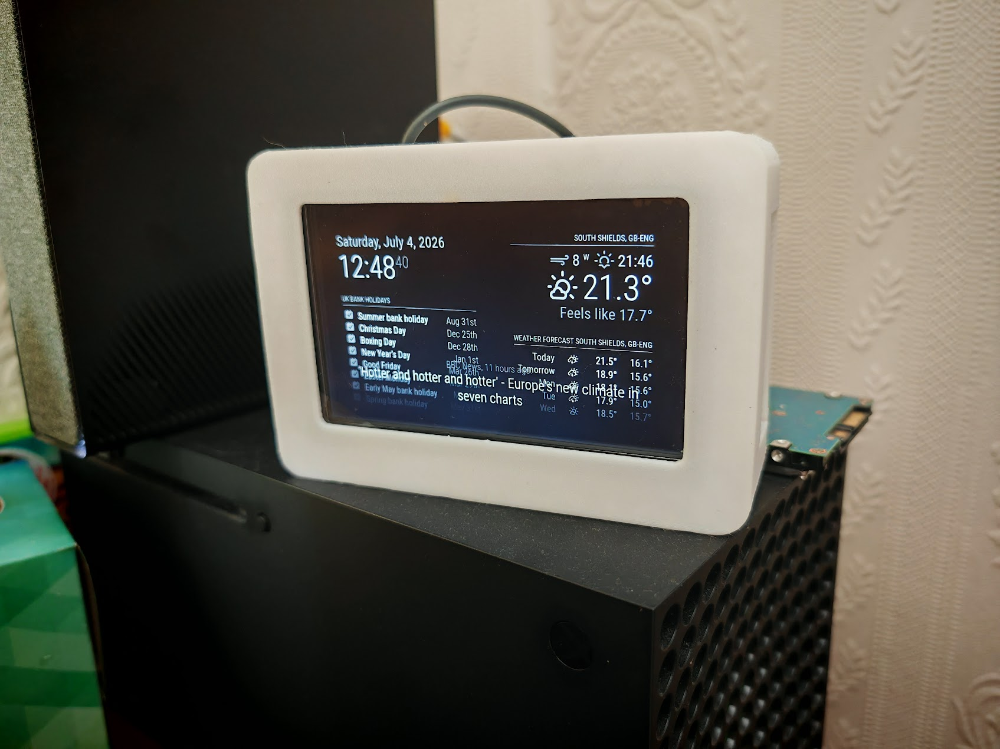
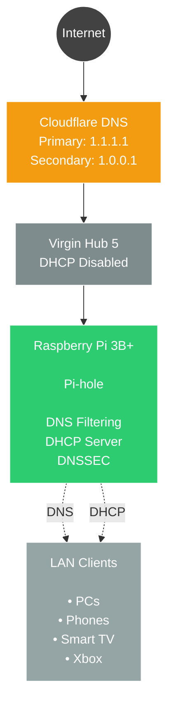
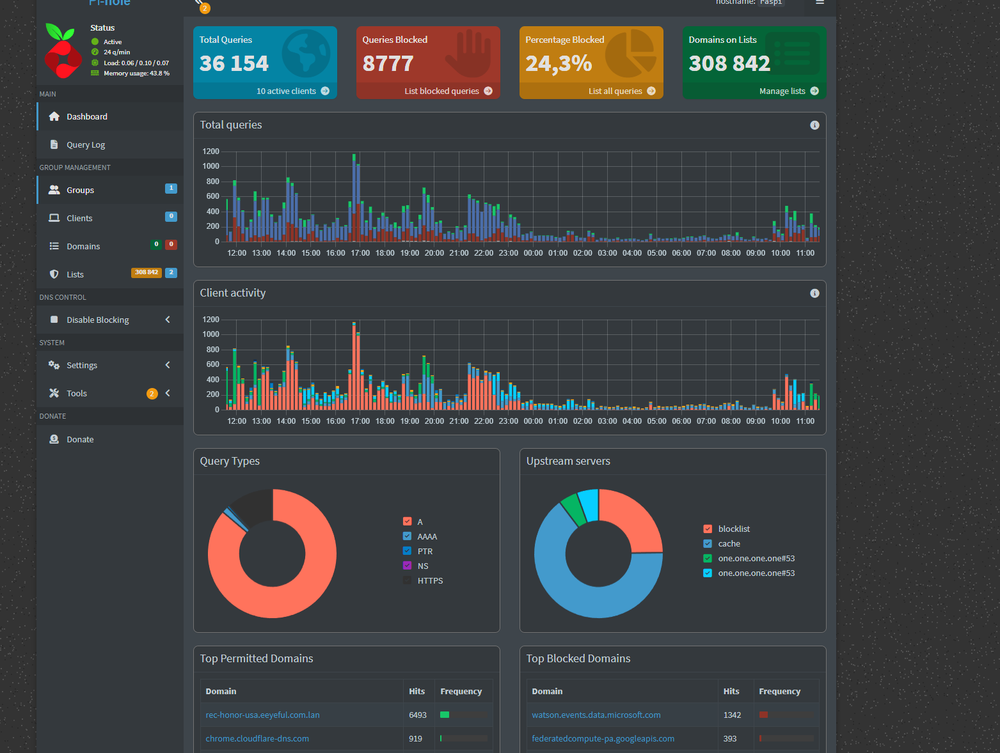
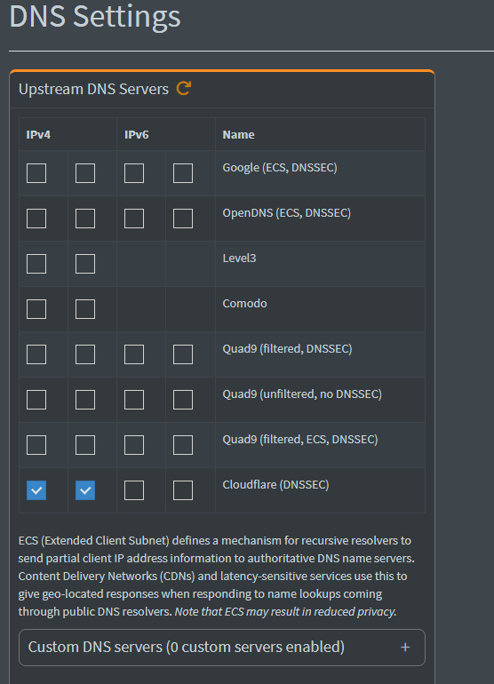
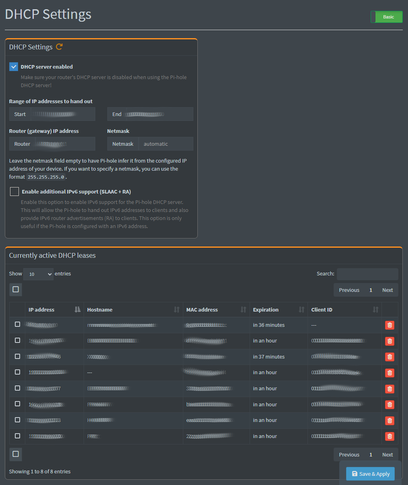

# Pi-hole DNS Server


<p align="center">
  
</p>

## Project Status

🟢 **Active**

Currently running 24/7 on my home network, providing DNS filtering and DHCP services for all connected devices.

---

## Project Overview

This project documents the deployment of a Pi-hole DNS server running on a Raspberry Pi 3B+ with 5-inch OSOYOO HDMI display housed in a custom 3D-printed enclosure.

The system provides network-wide DNS filtering and DHCP services for my home network, improving privacy, reducing advertisements and giving me practical experience with Linux administration, networking and self-hosted infrastructure.

---

## Key Achievements

- Deployed Pi-hole on Raspberry Pi 3B+
- Migrated DHCP from ISP router
- Implemented network-wide DNS filtering
- Configured Cloudflare DNS with DNSSEC
- Designed custom 3D-printed enclosure
- Created complete technical documentation

---

## Network Architecture

The diagram below illustrates the architecture of my home network. Pi-hole provides DNS filtering, DNSSEC validation and DHCP services, while the ISP router operates with DHCP disabled.



## Configuration Screenshots

### Dashboard



### DNS Configuration

Pi-hole uses Cloudflare DNS (1.1.1.1 / 1.0.0.1) with DNSSEC enabled.



### DHCP Configuration

Pi-hole is configured as the DHCP server for the local network after migrating DHCP services from the ISP router.



## Table of Contents

- [Project Status](#project-status)
- [Project Overview](#project-overview)
- [Network Architecture](#network-architecture)
- [Configuration Screenshots](#configuration-screenshots)
- [Objectives](#objectives)
- [Features](#features)
- [Hardware](#hardware)
- [Software](#software)
- [Project Specifications](#project-specifications)
- [Network Configuration](#network-configuration)
- [Installation](#installation)
- [Challenges](#challenges)
- [Results](#results)
- [Skills Demonstrated](#skills-demonstrated)
- [Lessons Learned](#lessons-learned)
- [Future Improvements](#future-improvements)
- [Repository Structure](#repository-structure)

---

## Objectives

- Deploy a self-hosted DNS filtering solution
- Configure Pi-hole as the primary DHCP server
- Disable DHCP on the Virgin Media Hub 5
- Provide network-wide advertisement and tracker blocking
- Learn DNS and DHCP administration
- Gain hands-on Linux administration experience

---

## Features

- Network-wide advertisement blocking
- DNS filtering
- DHCP server
- Cloudflare upstream DNS
- Web-based administration
- Real-time DNS query logging
- Raspberry Pi deployment
- Custom 3D-printed enclosure
- Dedicated 5-inch display

---

## Hardware

- Raspberry Pi 3B+
- 64 GB MicroSD Card
- OSOYOO 5-inch display
- Custom 3D-printed enclosure
- Virgin Media Hub 5

---

## Software

- Raspberry Pi OS
- Pi-hole

---

## Project Specifications

| Item             | Value              |
| ---------------- | ------------------ |
| Platform         | Raspberry Pi 3B+   |
| Operating System | Raspberry Pi OS    |
| DNS Server       | Pi-hole            |
| DHCP Server      | Pi-hole            |
| Upstream DNS     | Cloudflare         |
| Router           | Virgin Media Hub 5 |
| Network Type     | Home LAN           |

---

## Network Configuration

The Virgin Media Hub 5 DHCP service was disabled.

Pi-hole was configured to provide DHCP services, allowing every device connected to the home network to automatically receive Pi-hole as its DNS server.

Cloudflare is used as the upstream DNS provider for external DNS resolution.

---

## Installation

The installation process included:

1. Installing Raspberry Pi OS.
2. Installing Pi-hole using the official installation script.
3. Configuring Cloudflare as the upstream DNS provider.
4. Disabling DHCP on the Virgin Media Hub 5.
5. Enabling the Pi-hole DHCP server.
6. Testing DNS resolution from multiple client devices.
7. Verifying DHCP leases and DNS traffic.

---

## Challenges

The biggest challenge was configuring the Virgin Media Hub 5 correctly.

The router DHCP service had to be disabled before Pi-hole could successfully provide DHCP leases to all connected devices.

After the configuration changes, multiple devices were tested to ensure they automatically received the correct DNS settings from Pi-hole.

This troubleshooting process improved my understanding of how DHCP and DNS services interact within a home network.

---

## Results

The completed deployment provides:

- Network-wide DNS filtering
- Advertisement and tracker blocking
- Centralised DHCP management
- Cloudflare upstream DNS
- Web-based monitoring interface
- Reliable 24/7 operation
- DNS monitoring for all connected devices

---

## Skills Demonstrated

- Linux Administration
- Raspberry Pi Deployment
- DNS Configuration
- DHCP Configuration
- Home Network Administration
- Network Troubleshooting
- Self-hosted Infrastructure
- Service Deployment

---

## Lessons Learned

This project significantly improved my understanding of:

- DNS request flow
- DHCP lease management
- Raspberry Pi deployment
- Linux system administration
- Home network infrastructure
- Network troubleshooting

It also demonstrated the importance of testing network changes before deploying them across an entire home network.

---

## Future Improvements

Planned future improvements include:

- Enable encrypted DNS (DoH or DoT)
- Add network monitoring
- Improve dashboard monitoring
- Improve physical cable management
- Integrate additional self-hosted services
- Add automated backup of Pi-hole configuration

---


## Repository Structure

```text
Pi-hole-DNS/
│
├── images/
│   ├── hero.jpg
│   ├── dashboard.png
│   ├── dns-settings.png
│   └── dhcp-settings.png
│
├── CHANGELOG.md
├── LICENSE
└── README.md
```

---

